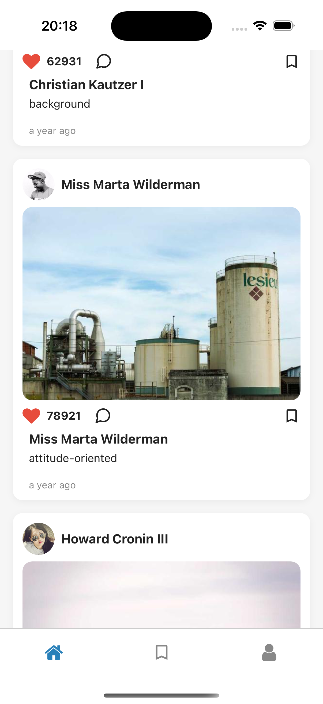

# Postly

Postly is a modern social app built with Expo, React Native, and TypeScript. It features a clean UI, profile management, post feed, saved posts, and settings, all powered by a modular architecture and best practices for state management, accessibility, and code quality.

---


## Video - Quick Tour
[](assets/quick_tour.mp4)

## Table of Contents

- [Features](#features)
- [Tech Stack](#tech-stack)
- [Project Structure](#project-structure)
- [Routing (Expo Router)](#routing-expo-router)
- [State Management](#state-management)
- [API Layer](#api-layer)
- [UI & Accessibility](#ui--accessibility)
- [Getting Started](#getting-started)
- [Running the App](#running-the-app)
- [Development Workflow](#development-workflow)
- [Building for Production](#building-for-production)
- [Contribution & Code Quality](#contribution--code-quality)

---

## Features

- Home feed with posts, likes, comments, and skeleton loaders
- Profile drawer with user info and settings
- Saved posts screen
- Modular, accessible UI components
- Global state management with Zustand
- TypeScript strict typing throughout
- Custom app icon and splash screen

---

## Tech Stack

- **React Native** (v19.0.0)
- **Expo** (v53)
- **Expo Router** for navigation
- **TypeScript** for type safety
- **Zustand** for global state management
- **React Query** for async data fetching/caching
- **Axios** for API requests
- **@gorhom/bottom-sheet** for modals
- **React Native Gesture Handler** and **Reanimated** for smooth UI
- **Expo Development Client** for native development

---

## Project Structure

```
app/
  _layout.tsx           # Main tab navigation (Home, Saved, Profile)
  index.tsx             # Home route
  saved.tsx             # Saved posts route
  settings.tsx          # App settings route
  profile/
    _layout.tsx         # Profile drawer (Profile, Settings)
    index.tsx           # Profile main screen
    settings.tsx        # Profile settings screen

src/
  api/                  # API abstraction (e.g., postsApi.ts)
  components/           # Reusable UI components
  screens/              # Screen containers (Home, Profile, Saved)
  store/                # Global state (Zustand)
  types/                # TypeScript types/interfaces

assets/
  icon.png              # App icon
  adaptive-icon.png     # Android adaptive icon
  splash-icon.png       # Splash screen image
  favicon.png           # Web favicon
```

---

## Routing (Expo Router)

Postly uses **Expo Router** for file-based navigation:

- `/` (Home): Main feed, shows posts with like/comment/save features.
- `/saved`: Shows all posts the user has saved.
- `/profile`: Opens a right-side drawer with:
  - `/profile/index`: User profile screen.
  - `/profile/settings`: Profile-specific settings.
- `/settings`: (Planned) App-wide settings.

**Navigation Structure:**

- The root uses a tab navigator: Home, Saved, Profile.
- The Profile tab opens a drawer with Profile and Settings.
- Custom drawer content displays user info and a sign-out button.

---

## State Management

- **Zustand** is used for global state (see `src/store/useFeedStore.ts`).
- Stores posts, likes, saved status, comments, and provides actions for toggling like/save and adding comments.
- All state is strongly typed.

---

## API Layer

- All API calls are abstracted in `src/api/postsApi.ts`.
- Uses **Axios** for HTTP requests.
- Example: `fetchPosts()` fetches posts from a mock API.
- Types are defined in `src/types/post.ts` for strong typing and decoupling.

---

## UI & Accessibility

- All components are functional and use React Hooks.
- Accessibility best practices are followed (labels, roles, etc.).
- Skeleton loaders are shown while data is loading.
- All touchable elements have accessibility labels.
- Styles are modularized per component.

---

## Getting Started

### Prerequisites

- **Node.js** (LTS version recommended)
- **npm** or **yarn**
- **Expo CLI** (`npm install -g expo-cli`)
- **Xcode** (for iOS development)
- **Android Studio** (for Android development)
- **Git**

### Installation

1. **Clone the repository:**
   ```sh
   git clone <repository-url>
   cd postly
   ```

2. **Install dependencies:**
   ```sh
   npm install
   ```

3. **Install Expo Development Client:**
   ```sh
   npx expo install expo-dev-client
   ```

---

## Running the App

### Option 1: Development Build (Recommended)

This creates a native build with your custom app icon and splash screen:

1. **Build and run on iOS:**
   ```sh
   npx expo run:ios
   ```

2. **Build and run on Android:**
   ```sh
   npx expo run:android
   ```

### Option 2: Expo Go (Quick Testing)

For quick testing without custom native code:

1. **Start the development server:**
   ```sh
   npx expo start
   ```

2. **Run on device/simulator:**
   - **iOS Simulator**: Press `i`
   - **Android Emulator**: Press `a`
   - **Physical Device**: Scan QR code with Expo Go app

### Option 3: Development Client

For development with native modules:

1. **Start with development client:**
   ```sh
   npx expo start
   ```

2. **Switch to development build:**
   - Press `s` to switch to development build mode
   - This will use your custom app icon and splash screen

---

## Development Workflow

### Making Changes

1. **Start development server:**
   ```sh
   npx expo start
   ```

2. **Make your changes** in the code

3. **Test changes:**
   - **Hot reload**: Changes appear automatically
   - **Full reload**: Press `r` in terminal
   - **Clear cache**: Press `shift+r` in terminal

### Adding Native Dependencies

1. **Install the package:**
   ```sh
   npx expo install <package-name>
   ```

2. **Rebuild native code:**
   ```sh
   npx expo prebuild --clean
   ```

3. **Run the app:**
   ```sh
   npx expo run:ios
   # or
   npx expo run:android
   ```

### Troubleshooting

**Common Issues:**

1. **Duplicate symbols error:**
   - Remove conflicting packages (e.g., `react-native-worklets` vs `react-native-reanimated`)
   - Run `npx expo prebuild --clean`

2. **Unimplemented component error:**
   - Install missing native dependencies
   - Run `npx expo install <missing-package>`

3. **Build failures:**
   - Clear cache: `npx expo start --clear`
   - Clean build: `npx expo prebuild --clean`

---

## Building for Production

### EAS Build (Recommended)

1. **Install EAS CLI:**
   ```sh
   npm install -g @expo/eas-cli
   ```

2. **Login to Expo:**
   ```sh
   eas login
   ```

3. **Configure EAS:**
   ```sh
   eas build:configure
   ```

4. **Build for production:**
   ```sh
   # iOS
   eas build --platform ios
   
   # Android
   eas build --platform android
   
   # Both
   eas build --platform all
   ```

### Local Build

1. **iOS Archive:**
   ```sh
   npx expo run:ios --configuration Release
   ```

2. **Android APK:**
   ```sh
   npx expo run:android --variant release
   ```

---

## Contribution & Code Quality

- All code must follow strict TypeScript typing (no `any`).
- Use camelCase for variables/functions, PascalCase for components/types.
- No direct coupling to SDKs/libraries in hooks/components—use interfaces and dependency injection.
- Follow the Single Responsibility Principle.
- All async logic must handle loading, success, and error states.
- All code must be manually reviewed before merging.
- Commit in small, logical chunks.

### Code Standards

- **Components**: Functional components with React Hooks only
- **State Management**: Zustand for global state, React Query for server state
- **Styling**: Modular styles per component
- **Accessibility**: WCAG compliance, proper labels and roles

---

## Credits

- Built with ❤️ using Expo and React Native.
